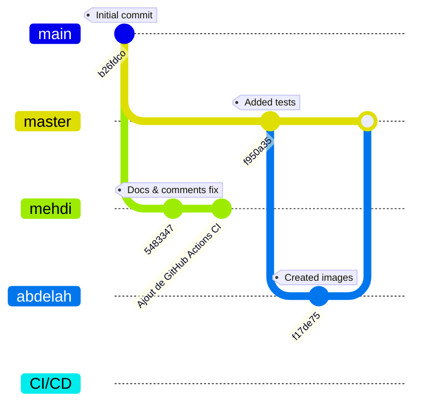

# ### # 📝 Cahier des Charges - Projet Blog Spring Boot

## 1. Description du Projet

**Nom du Projet**: Plateforme de Blog Collaboratif  
**Type**: Application Web Full Stack  
**Technologie Principale**: Spring Boot 3.2  

Ce projet vise à créer une plateforme moderne de blog permettant aux utilisateurs de publier et partager du contenu tout en favorisant les interactions sociales. L'application utilise Spring Boot comme framework principal, avec Thymeleaf pour le rendu côté serveur et Bootstrap pour une interface responsive.

### Objectifs Principaux
- ✅ Créer une plateforme de publication d'articles  
- ✅ Implémenter un système d'authentification sécurisé  
- ✅ Permettre les interactions sociales (commentaires/likes)  
- ✅ Garantir une interface responsive (mobile/desktop)  
- ✅ Atteindre 75%+ de couverture de tests  

## 2. Acteurs et Rôles

Le système distingue trois types d'utilisateurs, chacun avec des permissions et restrictions spécifiques:

| Rôle               | Permissions                              | Restrictions                  |
|--------------------|-----------------------------------------|-------------------------------|
| **Visiteur**       | Lecture des articles publics            | Pas d'interactions           |
| **Utilisateur**    | CRUD sur ses articles, commenter/aimer  | Édition propre contenu seulement |
| **Administrateur** | Modération, gestion utilisateurs        | Accès complet                |

## 3. Exigences Fonctionnelles

### 🔐 Authentification
- **FR1**: Inscription avec validation email  
- **FR2**: Connexion sécurisée (SprinbootSecurity/par sessions)  
- **FR3**: Réinitialisation de mot de passe  

### ✍️ Gestion de Contenu
- **FR4**: Éditeur de texte enrichi (Markdown)  
- **FR5**: Prévisualisation des articles  
- **FR6**: Système de brouillon

### 💬 Interactions
- **FR7**: Threads de commentaires imbriqués  
- **FR8**: Système de likes/partages  

## 4. Exigences Non-Fonctionnelles

### 🔒 Sécurité

- **Hash BCrypt pour les mots de passe** :
  - Implémentation via Spring Security dans la configuration
  - Stockage sécurisé sans texte clair visible
  - Complexité du hachage optimisée pour sécurité et performance

- **Protection CSRF activée** :
  - Tokens CSRF intégrés automatiquement sur chaque formulaire
  - Vérification côté serveur à chaque soumission POST
  - Protection visible dans le formulaire de connexion et de déconnexion

- **Validation des inputs côté serveur** :
  - Utilisation de l'annotation `@Valid` dans `AuthController`
  - Vérification des contraintes sur le modèle `User`
  - Gestion des erreurs par `BindingResult` avec affichage adapté

### 🚀 Performance
- Temps de réponse < 1s (90% des requêtes)  
- Support de 200 utilisateurs simultanés  

### 📱 Compatibilité
- Support navigateurs: Chrome, Firefox, Edge  

---

## 5. Gestion des Versions Git

### 🔀 Stratégie de Branches

La gestion du code source suit une stratégie personnalisée, avec plusieurs branches parallèles reflétant les travaux de développement et d'intégration continue :



### 📁 Organisation des Branches

- **`master`** : Branche principale pour les versions stables.
- **`abdelah`** : Branche de développement avec des améliorations d'UI et documentation.
- **`mehdi`** : Branche pour la mise en place de GitHub Actions (CI/CD).
- **`CI/CD`**: Branche dédiée à l'automatisation des pipelines d'intégration et de déploiement continus.

### 🔗 Dépôt Distant

```
https://github.com/abou57mehdi/Blog_Spring
```

---

### Bonnes Pratiques

- Commits atomiques avec messages descriptifs
- Pull requests obligatoires avant fusion vers develop
- Tests automatisés validés avant fusion
- Utilisation de tags pour marquer les versions 