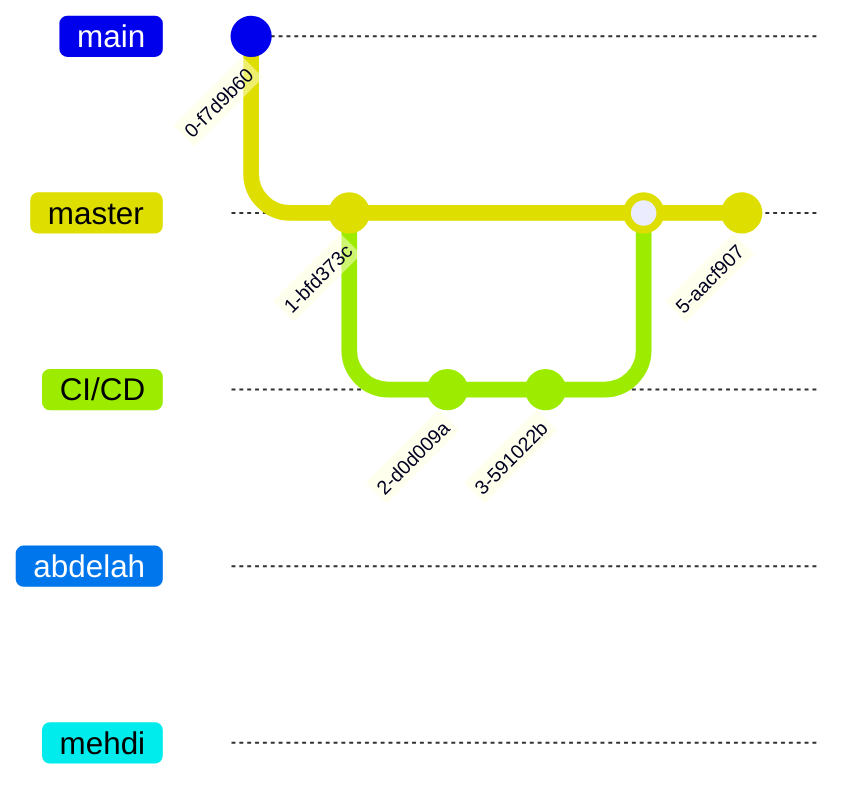

# Blog Spring - Documentation du projet

## 1. Présentation du projet
Le projet Blog_Spring est une application web de blog développée avec Spring Boot. Elle permet de créer et gérer des articles de blog avec un système de commentaires et d'authentification utilisateur.

## 2. Informations techniques
**Technologie** : Spring Boot 3.2.3  
**Version Java** : 17  
**Base de données** : H2 (fichier local)  
**Interface** : Thymeleaf  
**Sécurité** : Spring Security  

## 3. Configuration du dépôt
**Lien GitHub** : [Blog_Spring](https://github.com/abou57mehdi/Blog_Spring)  
**Collaborateurs** :
- abou57mehdi (propriétaire)
- Abdelah (collaborateur)
- mehdi (collaborateur)

## 4. Structure du projet
Le projet suit une architecture MVC (Model-View-Controller) :
```
src/main/
├── java/com/example/demo/
│   ├── config/           # Configuration Spring
│   ├── controller/       # Contrôleurs REST/Web
│   ├── model/            # Entités et modèles de données
│   ├── repository/       # Accès aux données (Spring Data JPA)
│   ├── service/          # Logique métier
│   └── DemoApplication.java
└── resources/
    ├── static/          # Ressources statiques (CSS, JS)
    ├── templates/       # Templates Thymeleaf
    └── application.properties # Configuration de l'application
```

## 5. Workflow Git
### Branches
- **master** : Branche principale de production
- **CI/CD** : Branche dédiée à l'intégration continue
- **abdelah** : Branche du collaborateur Abdelah
- **mehdi** : Branche du collaborateur mehdi

### Stratégie de branches


## 6. Pipeline CI/CD
Le projet utilise Jenkins pour l'intégration et le déploiement continu. Les étapes du pipeline incluent :

1. **SCM Checkout** : Récupération du code source
2. **Build** : Compilation avec Maven
3. **Test** : Exécution des tests unitaires
4. **Analyse du code** : 
   - Checkstyle
   - SpotBugs (FindBugs successor)
   - PMD
5. **JavaDoc** : Génération de la documentation
6. **Package** : Création du fichier JAR
7. **Deploy to Nexus** : Déploiement sur Nexus Repository
8. **Docker Preconditions** : Vérifications préalables au déploiement Docker
9. **Deploy to Docker** : Construction et déploiement d'une image Docker

### Configuration Jenkins
Le fichier Jenkinsfile définit l'ensemble du pipeline, incluant des notifications par email pour les builds réussis, échoués ou instables.

## 7. Configuration Docker
L'application est conteneurisée avec Docker :
```dockerfile
FROM openjdk:17-jdk-slim
WORKDIR /app
COPY target/*.jar app.jar
EXPOSE 8080
ENTRYPOINT ["java", "-jar", "app.jar"]
```

## 8. Gestion des environnements
| Environnement | Fichier de configuration | Base de données |
|---------------|--------------------------|-----------------|
| Développement | application.properties | H2 (fichier local) |

**Configuration de développement** :
```properties
# Configuration de base
spring.application.name=blog
server.port=8080

# Configuration H2
spring.datasource.url=jdbc:h2:file:./blogdb
spring.datasource.driverClassName=org.h2.Driver
spring.datasource.username=sa
spring.datasource.password=
spring.h2.console.enabled=true

# Configuration JPA
spring.jpa.hibernate.ddl-auto=update
spring.jpa.show-sql=true
```

## 9. Bonnes pratiques et améliorations
**Implémentées** :
- [x] Architecture MVC claire
- [x] Pipeline CI/CD complet avec Jenkins
- [x] Conteneurisation avec Docker
- [x] Déploiement vers dépôt Nexus
- [x] Analyses de qualité du code (Checkstyle, SpotBugs, PMD)
- [x] Tests unitaires automatisés
- [x] Génération de documentation JavaDoc

**À améliorer** :
- [ ] Couverture de tests plus complète
- [ ] Configuration d'environnements multiples (dev/test/prod)
- [ ] Mise en place d'une stratégie Git Flow plus formalisée
- [ ] Documentation utilisateur plus détaillée

---
*Dernière mise à jour : 2024-04-28* 